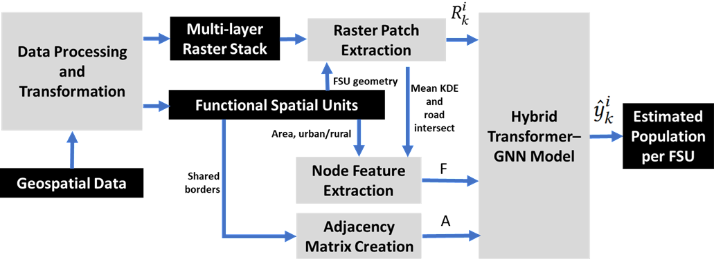
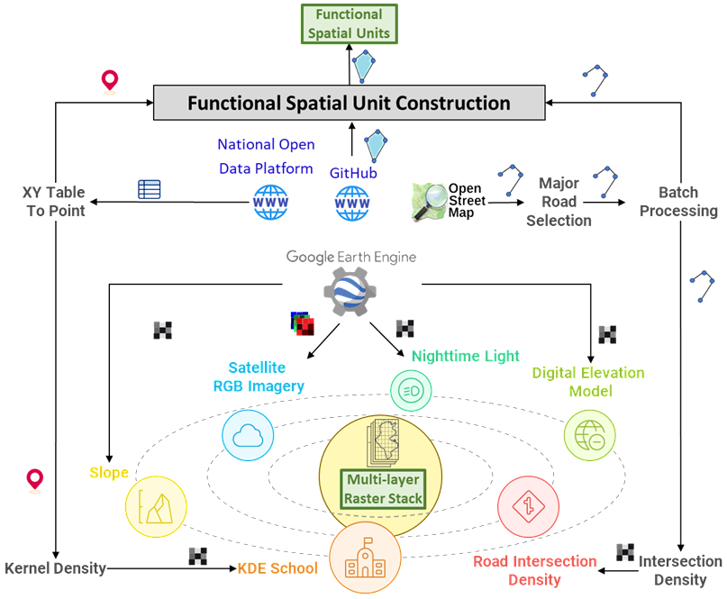
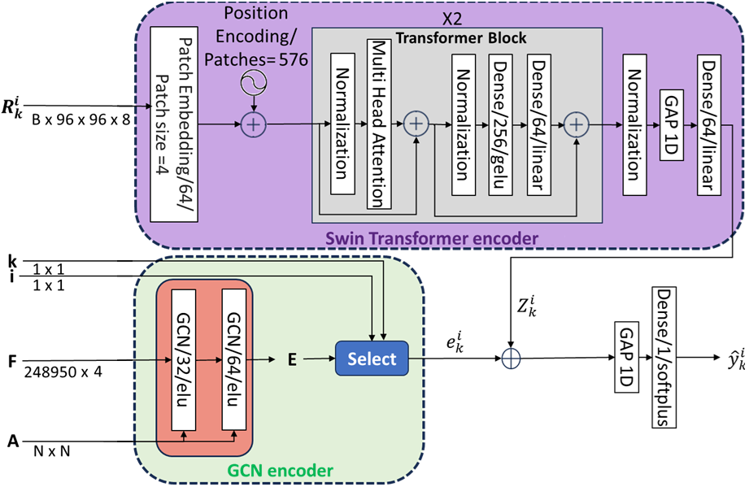

# VTG-Pop

VTG-Pop (Voronoi–Transformer–Graph Population model) is a hybrid deep learning framework designed for fine-grained population estimation from multimodal geospatial data.

The method integrates three key components:

• **Voronoi-based Functional Spatial Units (FSUs)** that combine administrative boundaries, points of interest, and road networks to produce meaningful spatial analysis units.  
• **Transformer-based visual encoding** to extract spatial patterns from multi-channel raster inputs.  
• **Graph Neural Networks (GNNs)** to model spatial dependencies between neighboring FSUs.

VTG-Pop predicts population distribution at a fine spatial scale while being trained using only sector-level census supervision. This weakly supervised learning strategy enables the generation of high-resolution population maps without requiring detailed ground-truth population data at the micro level.

The framework is evaluated on a nationwide dataset covering Tunisia, consisting of more than 24,000 Functional Spatial Units derived from 2,027 administrative sectors.
The location of the study area (**Tunisia**) is illustrated in the following figure:

The full workflow is illustrated in the following figure:

The full overview of the data collection and transformation pipeline is illustrated in the following figure:

The VTG-Pop  architecture  is illustrated in the following figure:

## Key Features

- Voronoi/Thiessen-based spatial unit construction
- Hybrid Transformer–Graph neural architecture
- Weakly supervised population estimation
- Multimodal geospatial inputs (raster + contextual features)
- Graph-based spatial interaction modeling

## Repository Contents

- `data_collection/` : scripts for collecting and preparing raw geospatial data (census sectors, road networks, POIs, etc.).
- `raster_processing/` : multi-layer raster construction
- `FSU_construction/` : Steps for generating Functional Spatial Units (FSUs)
- `models/` : VTG-Pop architecture implementation
- `training/` : training and evaluation pipeline
- `experiments/` : scripts used for the experimental evaluation
- `visualization/` : generation of population maps and analysis figures

## Citation

If you use this code or the VTG-Pop framework in your research, please cite:

*Citation information will be added after publication.*
